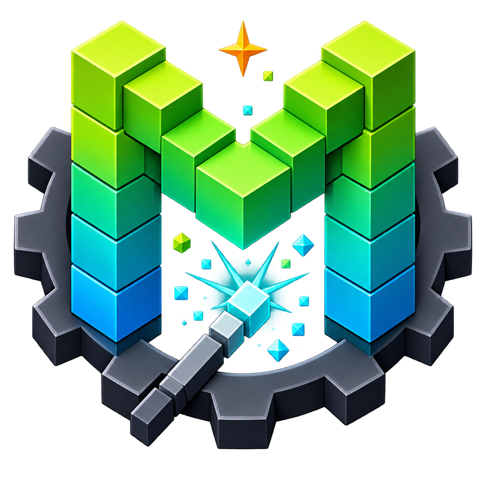
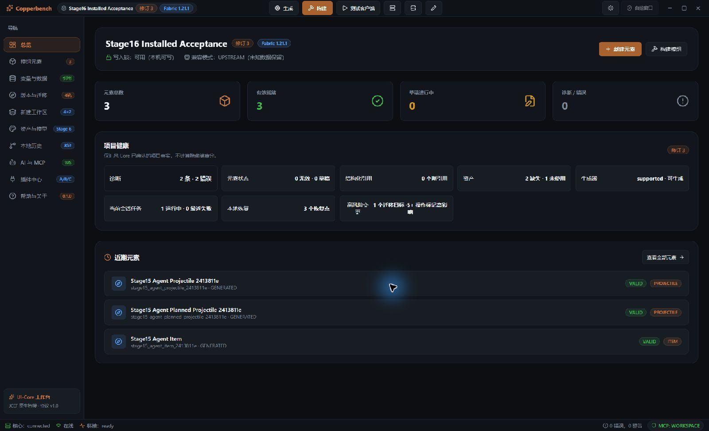
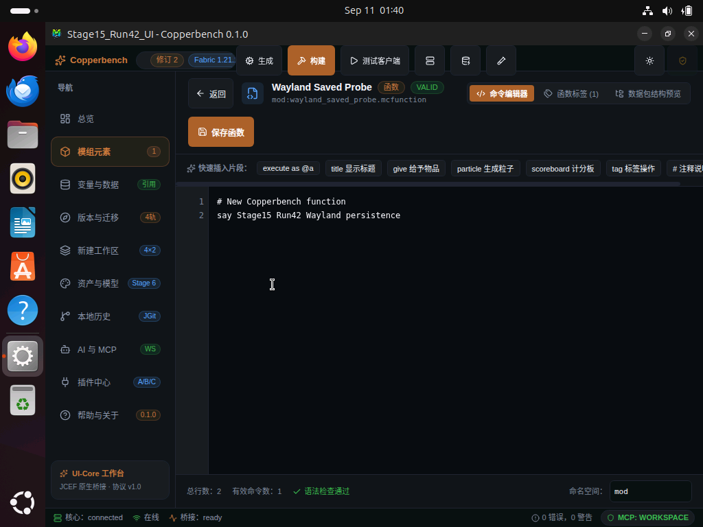
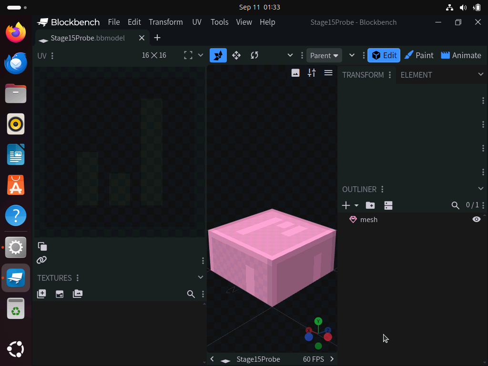
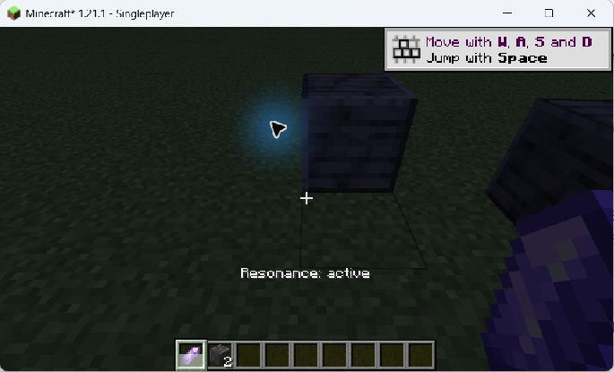
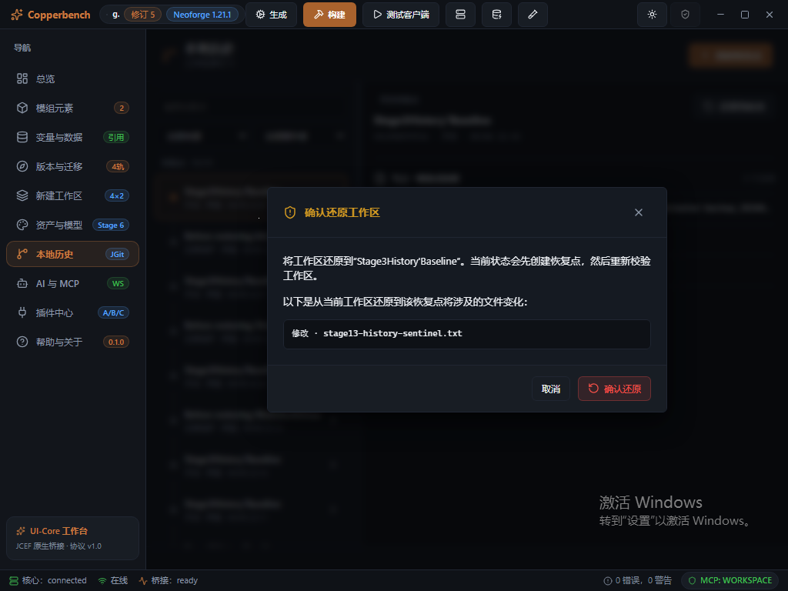

<div align="center">
  
  <h1>Copperbench</h1>
  <p><strong>Create, build, and test Minecraft Java mods on your desktop.</strong></p>
  <p><strong>English</strong> · <a href="README.zh-CN.md">简体中文</a></p>
  <p>
    <a href="https://github.com/Lotulune/Copperbench/releases">Downloads</a> ·
    <a href="#showcase">Screenshots</a> ·
    <a href="#getting-started">Getting started</a> ·
    <a href="#development">Run from source</a>
  </p>
</div>

Copperbench is built on MCreator, with mod element editors, Blockly logic, model and texture management, local history, and an MCP interface for external AI tools. It supports Fabric and NeoForge.

<a id="showcase"></a>

## See it in use

**Workbench** — View mod elements, project diagnostics, and build controls.



<table>
  <tr>
    <td width="50%"></td>
    <td width="50%"></td>
  </tr>
  <tr>
    <td><strong>Edit functions</strong><br>Write mcfunction commands, check syntax diagnostics, and save your work.</td>
    <td><strong>Work on models</strong><br>Edit models and textures in external Blockbench for use with workspace assets.</td>
  </tr>
  <tr>
    <td></td>
    <td></td>
  </tr>
  <tr>
    <td><strong>Test in game</strong><br>The test mod's Resonance Token displays its active state in Minecraft.</td>
    <td><strong>Restore a workspace</strong><br>Review affected files before confirming a restore.</td>
  </tr>
</table>

<sub>Screenshots are from Windows / Ubuntu tests in September 2026; later builds may look different. Blockbench is installed separately.</sub>

## What you can do

| Feature | In practice |
| --- | --- |
| Mods | Edit blocks, items, recipes, entities, and more; build procedures with Blockly. |
| Assets | Manage models, textures, tags, and translations; export resource pack ZIPs. |
| Builds | Build projects, launch test clients or dedicated servers, and inspect task logs. |
| History | Create local recovery points and preview the files a restore will change. |
| Migration | Preview same-version Fabric ↔ NeoForge migration into a new workspace. |
| Automation | Read projects, make changes, and run builds through local MCP or headless interfaces. |

See the [user guide](docs/user/README.md) for supported features. Source builds may include features absent from downloads; Bedrock Add-ons are outside the current first-party editing scope.

<a id="getting-started"></a>

## Getting started

| Platform | Packages | Installation |
| --- | --- | --- |
| Windows 11 x64 | EXE installer · Portable ZIP | [Windows quick start](docs/user/getting-started.md) |
| Ubuntu 24.04 LTS x86_64 | Debian `.deb` · Portable `.tar.gz` | [Linux installation notes](docs/releases/linux-release-notes.md) |

Ubuntu testing covers GNOME Wayland and Xorg. Other Linux distributions and architectures have not been validated.

1. **Download and install** — Choose the package for your system on [GitHub Releases](https://github.com/Lotulune/Copperbench/releases) and verify it against `SHA256SUMS.txt` on the same release page.
2. **Create a workspace** — Choose Fabric or NeoForge and a Minecraft version, then enter a mod name and workspace folder.
3. **Make an item** — Add an item, save and build the project, then launch the test client.

Packages are preview / beta builds. Windows installers are unsigned and may trigger SmartScreen. The first build needs an internet connection to download dependencies.

## Documentation

Most of the detailed guides below are currently written in Chinese.

- [User guide](docs/user/README.md) · [Troubleshooting](docs/user/troubleshooting.md)
- [MCP setup](docs/ai/getting-started.md) · [Agent examples](docs/ai/agent-playbook.md) · [SDK](sdk/README.md)
- [Development setup](docs/build/development-setup.md) · [Clean Windows build](docs/build/windows-clean-build.md)
- [Roadmap](PRD-NEXT.md) · [Contributing](CONTRIBUTING.md)

<a id="development"></a>

## Run from source

Requires JDK 25 (JetBrains Runtime with JCEF is recommended for the desktop app), Node.js 22, npm, and Git. The Windows commands below use PowerShell 7. Configure your JDK using the [development setup guide](docs/build/development-setup.md) first.

```powershell
git clone https://github.com/Lotulune/Copperbench.git
Set-Location Copperbench
npm ci --prefix ui-core
npm ci --prefix ui-shell
.\gradlew.bat runProductShell
```

On Linux, use `./gradlew runProductShell`. Builds use the Gradle Wrapper included in the repository.

## Credits and license

Copperbench is an independent derivative of MCreator, licensed under [GPL-3.0-only](LICENSE.txt). Thanks to Pylo and the [MCreator contributors](https://github.com/MCreator/MCreator/graphs/contributors). See [UPSTREAM.md](UPSTREAM.md) for the pinned upstream version and source records.

[Additional terms](LICENSE-ADDITIONAL-TERMS.md) retain the template exception, trademark terms, and Minecraft mappings notice. Third-party licenses and credits are in [license](license/) and [compliance](compliance/). MCreator is a trademark of Pylo; its names and logos are not licensed under the GPL.

**Not an official MCreator or Minecraft product. Not approved by or associated with Mojang or Microsoft.**
