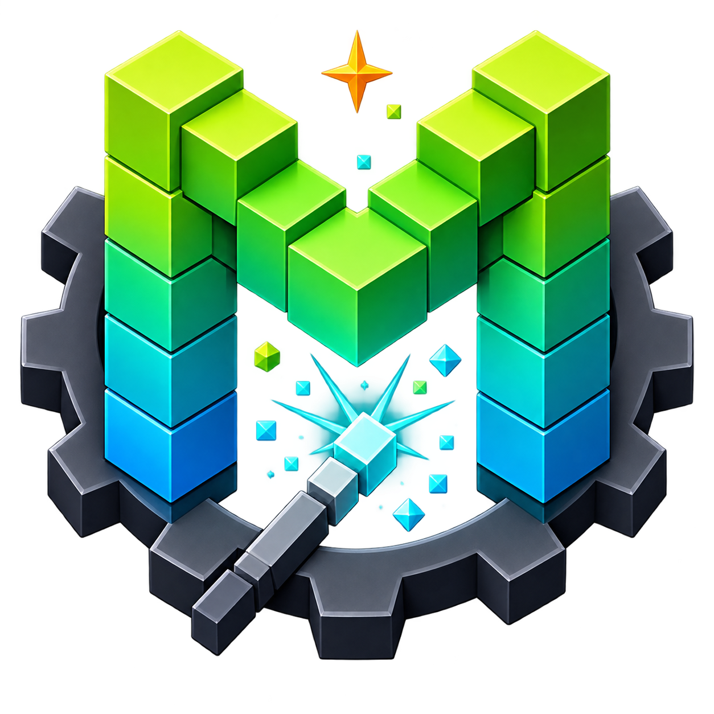
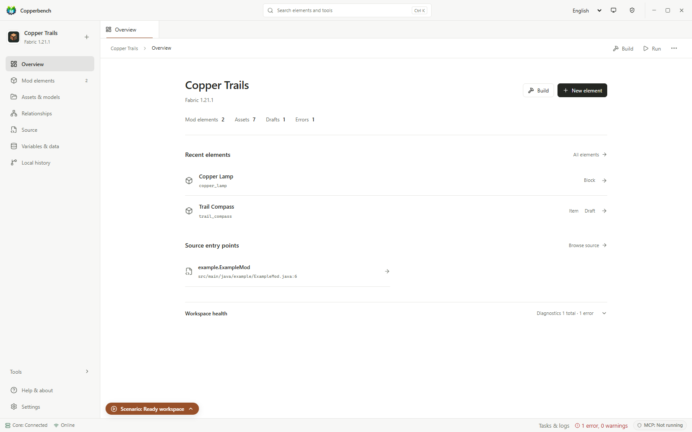
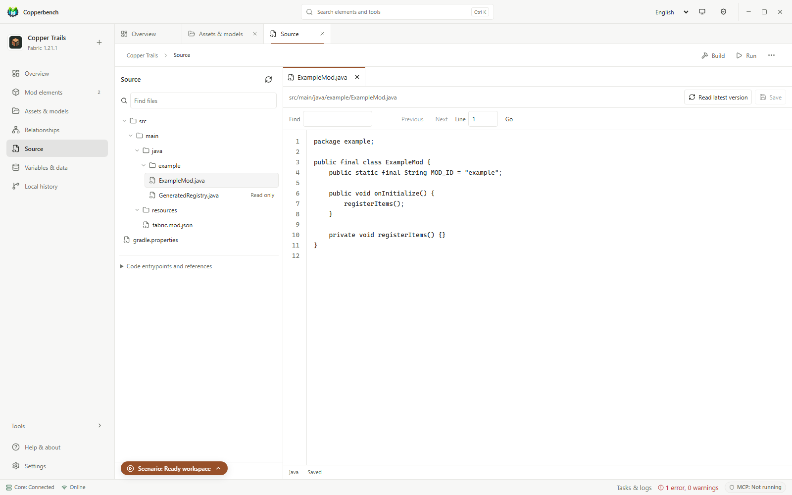
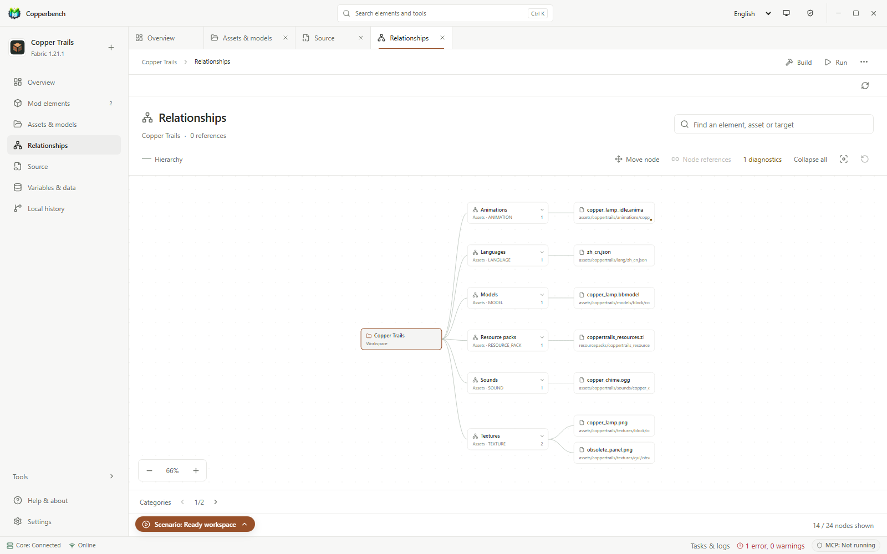

<div align="center">
  
  <h1>Copperbench</h1>
  <p><strong>Create, build, and test Minecraft Java mods on your desktop.</strong></p>
  <p><strong>English</strong> · <a href="README.zh-CN.md">简体中文</a></p>
  <p><a href="docs/releases/current.md">Download 0.1.4</a> · <a href="docs/README.md">Documentation</a> · <a href="#development">Run from source</a></p>
</div>

Copperbench is a Minecraft Java mod creation tool built on MCreator, with Fabric and NeoForge support. Create content with Mod Element editors and Blockly, edit manual source files, manage models and textures, and connect external AI tools through local MCP.

**Current stable release: 0.1.4 for Windows and Linux.** The refreshed workbench adds source editing, a relationship graph, asset filtering and previews, with simpler navigation and settings.

<a id="getting-started"></a>

## Download and get started

| Platform | Current release | Packages | Guide |
| --- | --- | --- | --- |
| Windows 11 x64 | [0.1.4](https://github.com/Lotulune/Copperbench/releases/tag/v0.1.4) | EXE · Portable ZIP · MSIX | [Quick start](docs/user/getting-started.md) |
| Ubuntu 24.04 LTS x86_64 | [0.1.4](https://github.com/Lotulune/Copperbench/releases/tag/v0.1.4-linux-stable) | Debian .deb · Portable .tar.gz | [Linux installation](docs/user/linux-installation.md) |

1. Download your platform's package and verify it against the attached checksum manifest.
2. Create a workspace and choose a loader and Minecraft version.
3. Add a Mod Element, save, build, and launch the test client.

The workbench supports English and Simplified Chinese. Bundled Fabric / NeoForge generators cover Minecraft **26.2, 26.1.2, 1.21.1 and 1.20.1**; each workspace uses one active generator.

Windows packages are not Authenticode-signed and may trigger SmartScreen. The first build needs network access; Blockbench is installed separately. Release checks passed for 0.1.4, while full installed-product and gameplay acceptance were not repeated. See [current downloads](docs/releases/current.md) for each platform's verification scope and known issues.

<a id="showcase"></a>

## Workbench



<table>
  <tr>
    <td width="50%"></td>
    <td width="50%"></td>
  </tr>
  <tr>
    <td><strong>Source</strong><br>File tree, search, editor tabs and read-only generated files.</td>
    <td><strong>Relationships</strong><br>Browse elements and assets, expand groups and locate related content.</td>
  </tr>
</table>

<sub>Browser captures of the 0.1.4 frontend with the bundled Copper Trails example data. [Capture details](assets/screenshots/README.md)</sub>

## What you can do

| Feature | In practice |
| --- | --- |
| Mod Elements and logic | Edit blocks, items, entities and more; build Procedures with Blockly. |
| Source | Browse, search and edit manual files, retain drafts and detect external changes. Generated files stay read-only. |
| Assets and models | Filter by type, inspect references, preview images and supported models, and open assets in Blockbench. |
| Relationship graph | Search, collapse, pan, zoom and move nodes; open their element or asset without changing business references. |
| Workspace tools | Edit variables, tags and translations; review diagnostics, local history, migrations and settings. |
| Builds and automation | Build projects, launch clients or servers, and drive workspace operations through MCP, SDKs or headless interfaces. |

See the [user guide](docs/user/README.md) for feature and generator coverage. Bedrock Add-ons are outside the current first-party Java editing scope.

## Documentation

Most detailed guides are currently in Chinese.

- [Documentation index](docs/README.md) · [User guide](docs/user/README.md) · [Troubleshooting](docs/user/troubleshooting.md)
- [MCP setup](docs/ai/getting-started.md) · [Agent examples](docs/ai/agent-playbook.md) · [SDK](sdk/README.md)
- [Development setup](docs/build/development-setup.md) · [Contributing](CONTRIBUTING.md) · [Repository layout](docs/maintenance/repository-maintenance.md)
- [Current follow-up](docs/remaining-work.md) · [Tests and release records](docs/testing/README.md) · [Historical roadmap](docs/roadmap/README.md)

<a id="development"></a>

## Run from source

Requires JDK 25 (JetBrains Runtime with JCEF is recommended for the desktop app), Node.js 22, npm, and Git. The Windows commands below use PowerShell 7. Configure your JDK using the [development setup guide](docs/build/development-setup.md) first.

```powershell
git clone https://github.com/Lotulune/Copperbench.git
Set-Location Copperbench
npm ci --prefix ui-core
npm ci --prefix ui-shell
.\gradlew.bat runProductShell
```

On Linux, use `./gradlew runProductShell`. Builds use the Gradle Wrapper included in the repository.

## Credits and license

Copperbench is an independent derivative of MCreator, licensed under [GPL-3.0-only](LICENSE.txt). Thanks to Pylo and the [MCreator contributors](https://github.com/MCreator/MCreator/graphs/contributors). See [UPSTREAM.md](UPSTREAM.md) for the pinned upstream version and source records.

[Additional terms](LICENSE-ADDITIONAL-TERMS.md) retain the template exception, trademark terms, and Minecraft mappings notice. Third-party licenses and credits are in [license](license/) and [compliance](compliance/). MCreator is a trademark of Pylo; its names and logos are not licensed under the GPL.

**Not an official MCreator or Minecraft product. Not approved by or associated with Mojang or Microsoft.**
