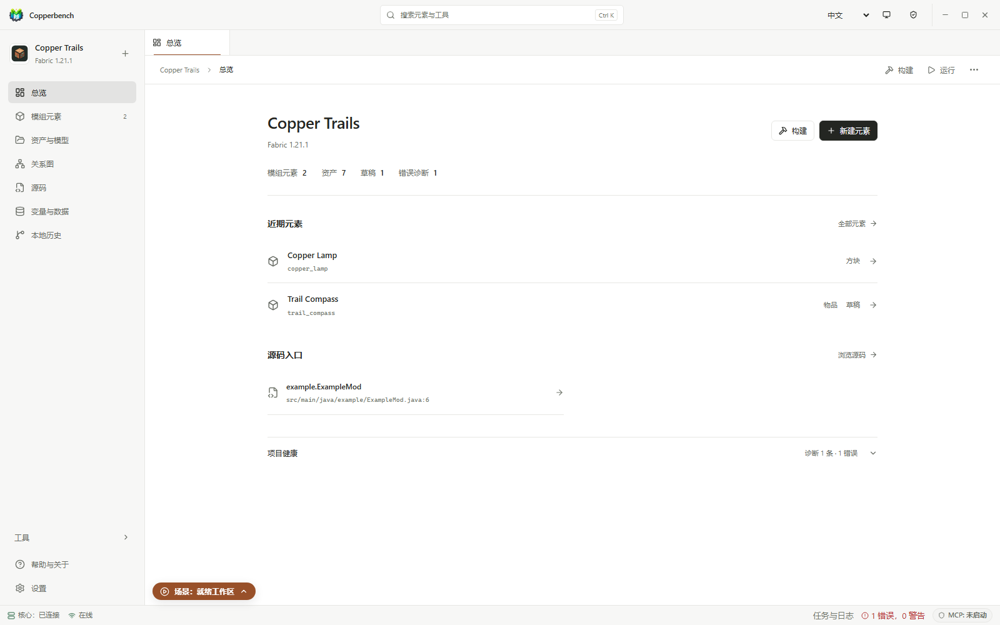
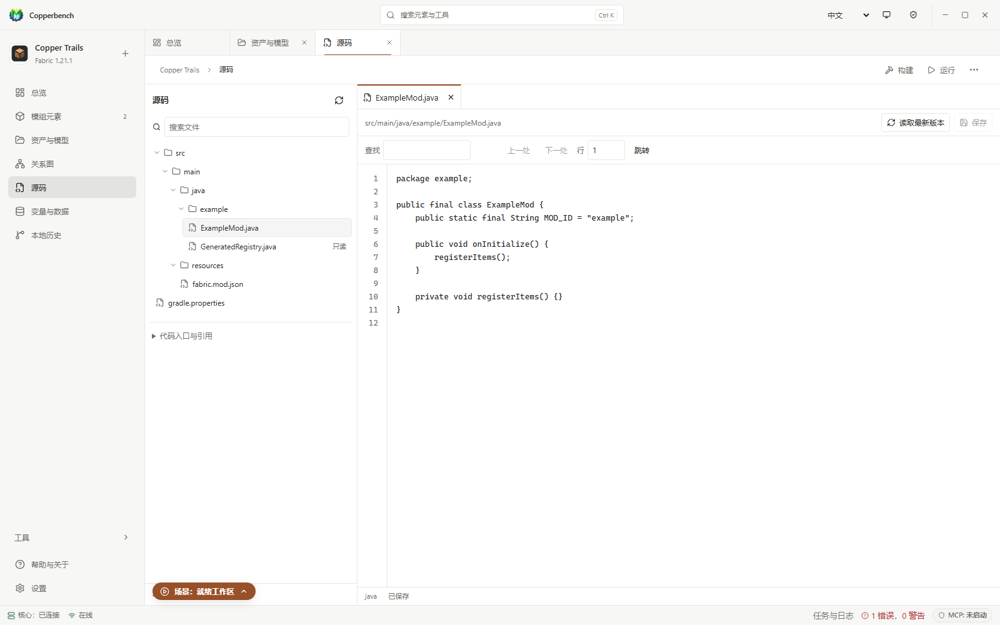
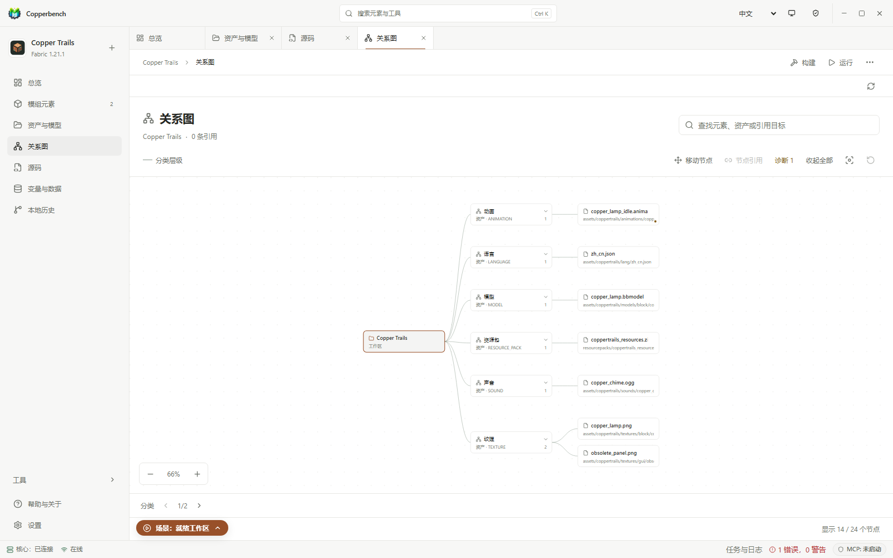

<div align="center">
  
  <h1>Copperbench</h1>
  <p><strong>在桌面上制作、构建和测试 Minecraft Java 模组。</strong></p>
  <p><a href="README.md">English</a> · <strong>简体中文</strong></p>
  <p><a href="docs/releases/current.md">下载 0.1.4</a> · <a href="docs/README.md">文档</a> · <a href="#development">源码运行</a></p>
</div>

Copperbench 是基于 MCreator 的 Minecraft Java 模组创作工具，支持 Fabric 和 NeoForge。用模组元素编辑器和 Blockly 制作内容，也可以编辑手写源码、管理模型与纹理，并通过本机 MCP 接入外部 AI 工具。

**当前稳定版：0.1.4，Windows 与 Linux 均已发布。** 新版工作台加入源码编辑、关系图、资产分类与预览，并简化导航和设置。

<a id="getting-started"></a>

## 下载与开始使用

| 平台 | 当前版本 | 安装包 | 指南 |
| --- | --- | --- | --- |
| Windows 11 x64 | [0.1.4](https://github.com/Lotulune/Copperbench/releases/tag/v0.1.4) | EXE · 便携 ZIP · MSIX | [快速开始](docs/user/getting-started.md) |
| Ubuntu 24.04 LTS x86_64 | [0.1.4](https://github.com/Lotulune/Copperbench/releases/tag/v0.1.4-linux-stable) | Debian .deb · 便携 .tar.gz | [Linux 安装](docs/user/linux-installation.md) |

1. 下载对应平台的安装包，用 Release 附带的校验文件核验。
2. 新建工作区，选择加载器和 Minecraft 版本。
3. 添加模组元素，保存、构建，然后启动测试客户端。

工作台支持简体中文和英文。内置 Fabric / NeoForge 生成器覆盖 Minecraft **26.2、26.1.2、1.21.1、1.20.1**；一个工作区同时使用一个活动生成器。

Windows 安装包未做 Authenticode 签名，可能出现 SmartScreen 提示。首次构建需要联网，Blockbench 需单独安装。0.1.4 的发布检查已通过，本次未重跑完整安装与游戏验收；各平台的实际验证范围和已知问题见[当前下载](docs/releases/current.md)。

<a id="showcase"></a>

## 工作台



<table>
  <tr>
    <td width="50%"></td>
    <td width="50%"></td>
  </tr>
  <tr>
    <td><strong>源码</strong><br>文件树、搜索、编辑标签页与生成文件只读标识。</td>
    <td><strong>关系图</strong><br>浏览元素与资产，展开分组并定位相关内容。</td>
  </tr>
</table>

<sub>0.1.4 前端的浏览器截图，使用内置 Copper Trails 示例数据。 [截图来源](assets/screenshots/README.md)</sub>

## 能做什么

| 功能 | 用法 |
| --- | --- |
| 模组元素与逻辑 | 编辑方块、物品、实体等元素，用 Blockly 编排 Procedure。 |
| 源码 | 浏览、搜索和编辑手写文件；保留草稿，检查外部修改冲突。生成文件只读。 |
| 资产与模型 | 按类型筛选模型、纹理等资产，检查引用，预览图片和支持的模型，连接 Blockbench。 |
| 关系图 | 搜索、折叠、平移、缩放和移动节点，点击打开元素或资产；不修改业务引用。 |
| 工作区工具 | 编辑变量、标签与翻译，查看诊断、本地历史、版本迁移和设置。 |
| 构建与自动化 | 构建、运行客户端或服务端，通过 MCP / SDK / headless 驱动工作区操作。 |

具体功能与生成器范围见[使用说明](docs/user/README.md)。Bedrock Add-on 不属于当前第一方 Java 模组编辑范围。

## 文档

- [文档导航](docs/README.md) · [使用说明](docs/user/README.md) · [故障排查](docs/user/troubleshooting.md)
- [MCP 接入](docs/ai/getting-started.md) · [Agent 操作示例](docs/ai/agent-playbook.md) · [SDK](sdk/README.md)
- [开发环境](docs/build/development-setup.md) · [贡献指南](CONTRIBUTING.md) · [项目目录与维护](docs/maintenance/repository-maintenance.md)
- [当前待办](docs/remaining-work.md) · [测试与发布记录](docs/testing/README.md) · [历史路线](docs/roadmap/README.md)

<a id="development"></a>

## 从源码运行

需要 JDK 25（桌面运行推荐带 JCEF 的 JetBrains Runtime）、Node.js 22、npm 和 Git；Windows 命令使用 PowerShell 7。先按[开发环境说明](docs/build/development-setup.md)配置 JDK。

```powershell
git clone https://github.com/Lotulune/Copperbench.git
Set-Location Copperbench
npm ci --prefix ui-core
npm ci --prefix ui-shell
.\gradlew.bat runProductShell
```

Linux 使用 `./gradlew runProductShell`。构建使用仓库自带的 Gradle Wrapper。

## 来源与许可

Copperbench 是 MCreator 的独立衍生项目，采用 [GPL-3.0-only](LICENSE.txt)。感谢 Pylo 和 [MCreator 贡献者](https://github.com/MCreator/MCreator/graphs/contributors)。上游版本与来源记录见 [UPSTREAM.md](UPSTREAM.md)。

[附加许可条款](LICENSE-ADDITIONAL-TERMS.md)保留了模板例外、商标及 Minecraft mappings 声明；第三方许可与致谢见 [license](license/) 和 [compliance](compliance/)。MCreator 是 Pylo 的商标，相关名称和标志不随 GPL 授权。

**本项目并非官方 MCreator 或 Minecraft 产品，未经 Mojang 或 Microsoft 批准，也与其无关联。**
