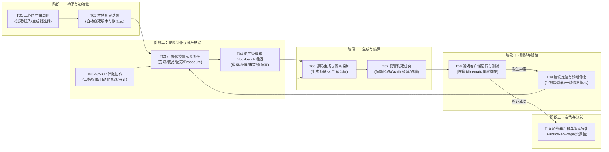

# 创作者任务地图（Creator Task Map）

> 状态：U0 已关闭（方向 A 已由产品壳落地）。阶段 8 收口缺口见 [`PRD-NEXT.md`](../../PRD-NEXT.md)。  
> 对应需求：`NFR-UI-01`、`NFR-UI-02`、`FR-WS-01~06`、`FR-MOD-01~06`、`FR-BUILD-01~06`、`FR-LOAD-01~07`、`FR-ASSET-01~07`、`FR-HIST-01~05`、`FR-MCP-01~08`、`FR-CLOSE-01~08`  
> 目标角色：个人 Minecraft 模组创作者（理解方块、物品、配方等游戏概念，不要求掌握 Java/Gradle/Git）

---

## 1. 创作者心智模型与旅程总览

Minecraft 模组创作不是编写 Java 类的过程，而是**将游戏创意（玩法、视觉、规则）具象化并放入 Minecraft 世界中实时体验**的探索过程。创作者的核心旅程分为 5 大阶段、10 大核心任务链：

---

## 2. 十大核心任务链详细定义

### T01: 工作区生命周期（初始化、打开与迁入）

- **用户意图**：开始一个新的模组项目，或打开现有项目/上游 MCreator 项目。
- **触发条件**：启动 Copperbench、点击“新建工作区”或“打开/迁入”。
- **交互路径**：
  1. 填写模组名称（如 `Copper Trails`）、Mod ID、主包名。
  2. 选择**活动生成器（Active Generator）**：优先推荐 `Fabric 1.21.1`，或四轨中的其它 Fabric / NeoForge。独立资源包工作区进入新产品外壳是 [PRD-NEXT](../../PRD-NEXT.md) `FR-CLOSE-06`，尚未宣称。
  3. 迁入上游 MCreator 工作区时，系统自动生成**迁入报告（Migration Report）**并做前置快照，标记未知字段保留策略。
- **底层契约**：
  - 发送 `Command: create_workspace`（需 `userApproved`）；打开已有工作区由宿主校验 `.mcreator` 后执行，不是单独的 `open_workspace` 命令
  - 返回 `Query: get_workbench`（状态 `ready` / `loading`）
  - `Query: list_new_workspace_generators` 返回四轨 × Fabric / NeoForge 以及独立 `resourcepack-1.21.1` 生成器目录与建议工作区根目录（产品外壳、MCP、headless 三入口共用 Core）
  - `create_workspace` 校验通过且用户确认后应写入 `.mcreator`；成功落盘自动测试与三入口一致见 `FR-CLOSE-02` / `FR-CLOSE-03`
- **异常与分支**：
  - 若已存在同名冲突或被外部占用 -> 返回 `LOCKED_ELSEWHERE` 诊断与解锁指引。
  - 上游包含未识别字段 -> 标记 `compatibility.unknownDataPreserved: true`，绝不静默删除。

---

### T02: 可视化模组元素创作与就地编辑（Mod Elements）

- **用户意图**：添加新方块（如铜灯）、自定义物品（如探险指南针）、合成配方或逻辑过程。
- **触发条件**：点击主动作“新建元素”或从列表双击已有元素。
- **交互路径**：
  1. 呼出“选择元素类型”面板（方块、物品、配方、Procedure 等）。
  2. 输入元素名称（如 `signal_lantern`），系统创建草稿并分配稳定 UUID。
  3. 在自适应属性检查器中编辑属性（硬度、亮度、材质引用、掉落物、音效）。
  4. 遇到加载器专属属性（如 NeoForge 燃烧传播速率）时，界面明确标识加载器归属与当前生效状态。
- **底层契约**：
  - 发送 `Command: create_mod_element`（携带 `expectedRevision`）
  - 成功时收到 `Event: mod_element_created`，修订号 `revision` +1
  - 发送 `Command: update_mod_element`，实时获取 `diagnostics`
- **异常与分支**：
  - 输入值越界（如硬度输入 -5） -> 收到 `FIELD_VALUE_OUT_OF_RANGE` 诊断，自动聚焦对应控件并提示范围 `[0, 100]`。
  - 并发写入冲突 -> 收到 `WORKSPACE_REVISION_CONFLICT`，提示外部更新并提供安全合并/查看最新修改。

---

### T03: 资产管理与 Blockbench 往返桥（Asset Round Trip）

- **用户意图**：为方块和实体制作 3D 模型、绘制像素纹理，并自动同步回 Copperbench。
- **触发条件**：在模组元素检查器中点击“使用 Blockbench 编辑模型”或资产库中右键 `.bbmodel`。
- **交互路径**：
  1. 系统检测本机 Blockbench 安装路径，启动受管外部子进程。
  2. 将目标 `.bbmodel` 路径授予最小受限访问租约。
  3. 用户在 Blockbench 中完成建模并保存。
  4. Copperbench 捕获文件变动事件，校验几何体命名与 UV 映射，触发本地历史快照。
  5. 资产列表自动刷新预览图与引用计数。
- **底层契约**：
  - 发送 `Command: launch_asset_tool`（指定 `assetId`, `tool: blockbench`）
  - 监听 `Event: asset_updated` 与 `Event: diagnostics_changed`
- **异常与分支**：
  - 未检测到 Blockbench -> 提供离线下载指引与手动指定路径。
  - 模型命名冲突或 UV 越界 -> 标记 `ASSET_INVALID_UV` 诊断，关联到具体贴图槽位。

---

### T04: 外部 AI / MCP 伴随协作（AI Control Plane）

- **用户意图**：通过外部 AI 客户端（如 Claude、Codex 等）通过自然语言批量创建配方、微调数值或诊断构建错误。
- **触发条件**：外部 AI 连接到本机 MCP 回环端口。
- **交互路径**：
  1. 创作者在产品顶部状态栏查看当前 MCP 状态与权限档位（`只读 Read Only` / `工作区 Workspace` / `完全访问 Full Access`）。
  2. AI 发起操作前，系统自动评估是否需要创建**恢复点（Recovery Point）**。
  3. 若涉及受保护操作（如批量重置、启用 Java 插件、删除工作区），系统在 Copperbench 界面弹出**强确认弹窗**，AI 不可代为点击。
  4. 操作完成后，界面无缝收到状态事件，元素列表与修订号实时推进，且在历史面板记录“AI 修改：来自 MCP 会话”。
- **底层契约**：
  - MCP 调用领域 Command，带工作区专属短期 Token
  - 发送 `Event: workspace_revision_advanced`（标记 `actor: mcp`）
- **异常与分支**：
  - AI 在只读模式下尝试写入 -> 返回 `PERMISSION_PROFILE_DENIED`，界面提示“AI 尝试执行构建，需提升为工作区权限”。
  - AI 操作导致校验不通过 -> 自动回滚或标记为草稿诊断，不产生半死状态。

---

### T05: 源码生成与代码隔离（Generator & Manual Source）

- **用户意图**：查看生成的 Java 代码以学习实现，或在必要时手写高级 Java 逻辑。
- **触发条件**：点击“查看生成代码”或“添加手写源码扩展”。
- **交互路径**：
  1. 查看由 FreeMarker 生成的 Fabric / NeoForge 源码（标记为 `ownership: generated`，只读锁保护）。
  2. 新建手写扩展文件（标记为 `ownership: manual`，独立文件夹存放）。
  3. 系统在重新生成时**严格保护手写源码**，提示哪些由生成器覆盖，哪些由创作者自维护。
- **底层契约**：
  - `Query: get_source_preview`
  - `Event: generator_state_changed`

---

### T06: 受管构建流水线（Managed Build Pipeline）

- **用户意图**：生成完整模组产物并编译打包为 `.jar`。
- **触发条件**：点击主工具栏“构建工作区（Build）”或快捷键 `Ctrl+B`。
- **交互路径**：
  1. 系统创建受管任务（`kind: build`），状态变为 `running`。
  2. 底部任务栏升起，显示步骤进度（`0.1 正在解析依赖` -> `0.65 正在编译生成源码` -> `1.0 构建完成`）。
  3. 右侧/底部日志窗口平滑流式输出脱敏后的构建关键信息（屏蔽乱码与无关 Gradle 堆栈）。
  4. 支持随时点击“取消任务”，系统安全终止外部 Java 进程并清理临时锁。
- **底层契约**：
  - 发送 `Command: build_workspace`
  - 监听 `Event: task_progressed`、`Event: task_log_appended`、`Event: task_completed`
- **异常与分支**：
  - 依赖下载超时或断网 -> 诊断标记 `OFFLINE_BUILD_LIMITED`，提示使用本地缓存或重试。
  - 代码编译报错 -> 诊断解析器将 Gradle 错误行定位到具体模组元素与字段路径。

---

### T07: 游戏客户端调试运行（Managed Minecraft Client）

- **用户意图**：一键启动包含当前模组的 Minecraft 游戏，进入测试世界体验。
- **触发条件**：点击“运行测试客户端（Run Client）”或快捷键 `F5`。
- **交互路径**：
  1. 系统后台调度 `run_client` 任务，自动热装载当前 Fabric 产物。
  2. 标题栏状态胶囊显示“Minecraft 运行中 (PID: xxxx)”。
  3. 创作者在游戏中测试方块放置、物品拾取与配方合成。
  4. 正常退出游戏后，状态恢复为就绪；若游戏崩溃，窗口弹出诊断卡片。
- **底层契约**：
  - 发送 `Command: run_client`
  - 监听 `Event: external_process_exited`
- **异常与分支**：
  - 游戏异常退出（如 `exitCode: 1`） -> 触发 `EXTERNAL_PROCESS_EXITED` 诊断，一键提取关键 Crash Report 并提供“查看崩溃日志”操作。

---

### T08: 故障排查与诊断闭环（Diagnostics & Healing）

- **用户意图**：快速发现并修复工作区中任何影响构建或运行的问题。
- **触发条件**：任何时刻检查器或状态栏显示警告/错误红点。
- **交互路径**：
  1. 状态栏显示全局诊断汇总（如 `1 错误, 2 警告`）。
  2. 点击错误条目，界面平滑定位并聚焦到对应元素及具体出错字段（如 `/fields/hardness`）。
  3. 字段输入框外围以高对比度错误态呈现，下方附带可操作修复建议（如“重置为默认值”或“修正数值范围”）。
  4. 修复完成后，诊断计数实时消减，工作区恢复健康状态。

---

### T09: 本地版本历史与恢复点（Local History & Recovery）

- **用户意图**：尝试重大改动前保存状态，或在误操作/AI出错时一键还原。
- **触发条件**：点击“版本历史”面板，或在修改后点击“创建恢复点”。
- **交互路径**：
  1. 创作者查看按时间线排列的本地版本树（使用直观标签，如“AI批量修改前”、“添加铜灯后”）。
  2. 点击任一历史版本，直观对比元素差异（新增、修改字段、资产替换）。
  3. 点击“还原到此版本”，系统执行事务性回滚，更新工作区至指定快照。
  4. 回滚后自动执行完整性校验，确认所有元素引用完整无死链。
- **底层契约**：
  - 发送 `Command: restore_recovery_point`
  - 返回新的 `revision` 并刷新 `workbenchProjection`

---

### T10: 加载器迁移与跨版本导出（Loader Migration & Export）

- **用户意图**：将做好的 Fabric 模组迁移到 NeoForge，或导出为独立分发包。
- **触发条件**：点击菜单“工作区迁移”或“导出 Mod/资源包”。
- **交互路径**：
  1. 触发迁移向导，选择目标加载器（如 `NeoForge 1.21.1`）。
  2. 系统在后台生成**迁移预览报告**（标注：完全支持 18 项、自动转换 4 项、NeoForge 特性待补 1 项、不支持 0 项）。
  3. 确认后，系统**创建新工作区副本**，绝不原地破坏源 Fabric 工作区。
  4. 自动打开新工作区，保留所有通用字段与原版标识。

---

## 3. 创作者任务流与状态流转矩阵

| 任务状态 | 用户界面感知 | 允许的操作 | 限制与保护 | 对应 Core 场景 Fixture |
| :--- | :--- | :--- | :--- | :--- |
| **就绪 (Ready)** | 绿色就绪圆点、元素卡片正常显示、构建按钮可用 | 新增/编辑元素、构建、运行客户端、Blockbench | 无限制 | `ready.json` |
| **空工作区 (Empty)** | 友好的首屏引导插画、显眼的大号“创建第一个元素”按钮 | 创建元素、导入样例、切换加载器 | 构建与运行置灰 | `empty-workspace.json` |
| **加载中 (Loading)** | 骨架屏（Skeleton Loader）、布局结构稳定不跳动 | 取消加载 | 禁用任何编辑写入 | `loading-workbench.json` |
| **长任务进行中 (Running)** | 顶部微进度条、底部任务悬浮卡、阶段性文字描述 | 取消任务、浏览其它元素 | 禁用并发构建与破坏性迁移 | `build-running.json` |
| **校验失败 (Validation Error)** | 字段边框告警、错误说明浮条、修复指引按钮 | 修复对应字段、撤销修改 | 阻止直接导出与构建 | `validation-failed.json` |
| **只读/权限受限 (Permission Denied)** | 黄色权限指示器、醒目“请求工作区权限”按钮 | 浏览元素、导出日志、申请提权 | 阻止直接写入与后台构建 | `permission-denied.json` |
| **版本冲突 (Revision Conflict)** | 弹出冲突仲裁模态框、高亮显示冲突字段与修改来源 | 查看最新版本、覆盖合并、保留副本 | 阻止旧数据强行覆盖 | `revision-conflict.json` |
| **部分能力 (Partial Capability)** | 字段旁带加载器徽标、只读并保留数值 | 编辑通用字段、查看提示 | 不可修改非活动加载器专属字段 | `partial-capability.json` |
| **离线状态 (Offline)** | 状态栏显示“本地离线模式”、无打扰黄色小标 | 本地创作、缓存依赖构建、Blockbench | 禁用依赖云更新与外部 MCP 远程调用 | `offline.json` |
| **进程崩溃 (Process Exited)** | 红色警告卡片、展示退出码与一键打开日志按钮 | 重新启动、打开诊断日志、回滚快照 | 防止残留僵尸进程 | `external-process-exited.json`|
| **外壳恢复 (Bridge Recovery)** | 显示“JCEF 渲染异常恢复”、按最后已提交版本同步 | 一键刷新重载、检查未提交草稿 | 不声称未提交请求已保存 | `bridge-recovery.json` |
