# 信息架构与自适应工作台规范（Information Architecture & Adaptive Workbench）

> 状态：U0 已关闭。选定方向 A「专注工坊流」（左导航轨 + 自适应主区 + 检查器）。B/C 仅作历史原型。  
> 对应需求：`NFR-UI-01`、`NFR-UI-02`、`NFR-UI-03`、`NFR-UI-04`、`NFR-UI-05`、`NFR-UI-06`、`NFR-UI-07`、`NFR-UI-08`  
> 架构原则：高信息密度、自适应重排、离线优先、无边框系统级融合、类型化契约驱动

---

## 1. 顶层信息架构全景（IA Hierarchy）

```mermaid
graph TD
    Root["Copperbench 桌面产品外壳 (Java/JCEF Host)"]
    
    Root --> TopBar["受控标题栏 (Custom Frameless Titlebar)"]
    Root --> MainNav["左侧主导航轨 (Primary Navigation Rail)"]
    Root --> ContentArea["自适应主工作区 (Adaptive Content Canvas)"]
    Root --> BottomBar["状态与任务底栏 (Status & Task Footer)"]

    TopBar --> TB_Brand["品牌与工作区标识 (Workspace Pill)"]
    TopBar --> TB_Loader["活动生成器状态 (Active Generator Badge)"]
    TopBar --> TB_Build["快速动作组 (Build / Run / Validate)"]
    TopBar --> TB_Window["Windows 窗口控制 (Min / Max / Snap / Close)"]

    MainNav --> M1["工作区总览 (Workspace Hub)"]
    MainNav --> M2["模组元素 (Mod Elements)"]
    MainNav --> M3["资产管理 (Assets & Blockbench)"]
    MainNav --> M4["版本历史 (Local History & Snapshot)"]
    MainNav --> M5["AI 与 MCP (AI Control & Permissions)"]
    MainNav --> M6["插件中心 (Plugins & Compatibility)"]

    ContentArea --> C_Hub["工作区总览屏: 健康度 / 统计 / 快捷创建 / 任务流"]
    ContentArea --> C_Elements["模组元素工作台: 过滤树 / 卡片网格 / 属性检查器"]
    ContentArea --> C_Assets["资产中心: 2D纹理 / 3D模型 / Blockbench桥 / 引用网"]
    ContentArea --> C_History["本地历史: 时间线 / 差异对比 / 恢复点回滚"]
    ContentArea --> C_AI["AI/MCP: 权限档位 / 会话审计 / 受保护确认"]
    ContentArea --> C_Plugin["插件管理: A/B/C兼容分级 / 旧版Swing窗口桥"]

    BottomBar --> BB_Conn["连接状态 (Core / Network / Bridge)"]
    BottomBar --> BB_Perm["MCP 权限胶囊 (Read / Workspace / Full)"]
    BottomBar --> BB_Diag["全局诊断汇总 (Error / Warning / Info)"]
    BottomBar --> BB_Task["活动任务与抽屉 (Active Task Progress & Drawer)"]
```



---

## 2. 四大核心任务面详细设计

### 2.1 工作区总览区（Workspace Hub）
- **定位**：创作者启动后的第一视觉锚点，提供项目全貌、健康状况、近期改动与快速入口。
- **信息组件**：
  1. **工作区状态卡片**：展示模组名称、当前活动生成器（如 `Fabric 1.21.1`）、当前修订号（`Revision: 42`）、锁状态与模式（`Native / Upstream`）。
  2. **元素健康度看板**：展示总数、有效（Valid）、草稿（Draft）、异常（Invalid）、不支持项（Unsupported）。
  3. **最近编辑队列**：列出最近修改的模组元素与资产，支持一键继续编辑。
  4. **全局受管任务卡片**：展示当前正在执行的后台任务（生成、构建、运行中客户端）。
  5. **快捷动作条**：新建方块、新建物品、新建配方、打开 Blockbench、一键完整构建。

### 2.2 模组元素工作台（Mod Elements Workbench）
- **定位**：创作者 80% 时间停留的核心生产力区域，负责元素的浏览、过滤、创建与属性配置。
- **布局划分**：
  - **左子栏（过滤与组织）**：
    - 类型筛选器（方块 Block、物品 Item、合成配方 Recipe、过程 Procedure、手写扩展 Manual）。
    - 状态筛选器（全部、已完成、草稿中、有错误、加载器专属）。
    - 快速搜索框（支持名称、标识符和标签匹配）。
  - **中主区（元素视图）**：
    - **看板/卡片模式**：高保真预览图标、元素类型小标、有效性光标、所有权标签（`Generated / Manual`）。
    - **紧凑表格模式**：名称、ID、类型、诊断状态、最后修改时间，适合大量元素批处理。
  - **右侧栏（上下文属性检查器 Contextual Inspector）**：
    - **基本信息段**：显示名称、标识符、命名空间。
    - **物理/行为参数段**：硬度、抗性、发光等级、工具挖掘类型、掉落规则（带实时数值约束验证）。
    - **材质与资产绑定段**：六面贴图选择器、Blockbench 模型绑定入口。
    - **加载器专属扩展段**：清晰标明 `Fabric 专属` 或 `NeoForge 专属`（不可用时保留只读数值与保留提示，防止数据漂移）。

### 2.3 受管任务与构建控制台（Managed Tasks & Build Console）
- **定位**：管理所有长耗时外部进程，提供非阻塞进度感知、结构化日志与中断能力。
- **交互形态**：
  - **轻量形态（常驻底栏）**：微型线性进度条 + 阶段文案（如 `0.65 正在编译生成源码`）+ 取消按钮。
  - **展开形态（底部抽屉/右侧浮层）**：
    - **任务阶段时间轴**：依赖解析 -> 代码生成 -> Java 编译 -> 资源打包 -> 产物就绪。
    - **脱敏流式日志**：高对比度日志查看器，过滤多余 Gradle 堆栈，保留关键编译器输出。
    - **任务控制**：暂停、安全取消（自动清理外部进程锁）、重试、导出日志。

### 2.4 全局状态与安全监视（Global Status & Security Monitor）
- **定位**：为创作者提供全方位的环境感知，杜绝“静默失败”与“越权操作”。
- **监视指标**：
  1. **Core / JCEF 连接状态**：`connected / reconnecting / disconnected`。
  2. **离线网络状态**：`online / offline / limited`（离线时标明本地功能可用）。
  3. **MCP 权限档位**：`Read Only (只读)` / `Workspace (工作区)` / `Full Access (完全访问)`，点击可查看授权详情与申请提权。
  4. **单写者锁状态**：当前写入权持有者（UI 用户 / 外部 MCP 会话）。
  5. **全局诊断指示器**：统一收集工作区各处的错误、警告与建议，支持一键导航。

---

## 3. 四大进阶模块规划

```text
┌────────────────────────────────────────────────────────────────────────┐
│                        四大进阶模块 (阶段 2-7 扩展)                     │
├──────────────────┬──────────────────┬──────────────────┬───────────────┤
│ 1. 资产与 Blockbench │ 2. 本地版本历史  │ 3. AI / MCP 权限 │ 4. 插件兼容中心 │
│ - 纹理贴图槽位   │ - JGit 恢复点    │ - 三档权限切换   │ - A/B/C 分级  │
│ - .bbmodel 往返  │ - 历史版本时间轴 │ - 短期 Token 审计│ - 旧版 Swing  │
│ - 资产引用治理   │ - 字段级差异对比 │ - 受保护操作强审 │   隔离窗口    │
│ - 声音/多语言    │ - 一键安全回滚   │ - 冲突仲裁机制   │ - 签名与安全  │
└──────────────────┴──────────────────┴──────────────────┴───────────────┘
```

---

## 4. 自适应工作台视口规范（Adaptive Workbench Specification）

为贯彻 `NFR-UI-03` 与 `NFR-UI-04`，界面拒绝简单的比例缩放（Avoid Whole-page Scale），而是根据可用像素和 Windows DPI 缩放采用**分级自适应布局（Adaptive Grid & Drawer System）**：

| 视口规格 | 目标分辨率 & 缩放 | 侧导航栏 | 中间主视图 | 右侧检查器 | 任务与诊断 |
| :--- | :--- | :--- | :--- | :--- | :--- |
| **紧凑型 (Compact)** | 1366×768 (100%/125%) | 收缩为 56px 极窄图标轨 | 占据主要视口，卡片流 2 列排布 | 默认折叠，点击元素后以 360px 抽屉滑出 | 底部吸底单行，点击弹出浮动面板 |
| **标准型 (Standard)** | 1920×1080 (100%/125%/150%) | 200px 完整导航菜单 | 居中主画布，卡片流 3-4 列排布 | 340px 常驻右侧栏，无缝就地编辑 | 底部 220px 可折叠控制台/抽屉 |
| **宽屏/超宽型 (Wide/4K)** | 2560×1440 / 3840×2160 (150%/175%/200%) | 240px 完整树形导航 | 宽幅多列卡片网格或双栏并排 | 420px 扩展属性栏（带 3D 实时模型预览） | 右下角常驻多任务与实时日志监控区 |

### Windows DPI 缩放与无障碍保证（Accessibility & Scaling）
- 最小可读字号：正文不小于 `14px`，辅助说明与标签不小于 `12px`。
- 对比度硬指标：所有文本与交互控件保持 `WCAG AA (≥ 4.5:1)` 对比度。
- 全键盘无障碍：支持 `Tab` 键轮询、`Enter / Space` 触发、`Esc` 关闭模态、方向键卡片穿梭，所有焦点带高可见度焦点环。
- 触控/高 DPI 命中区：所有可点击控件最小命中面积保持 `32×32px`（触控模式下 `44×44px`）。

---

## 5. 无边框窗口与系统桥接合同（Frameless Window Contract）

为满足 `NFR-UI-05` 与 `NFR-UI-06`：
1. **标题栏区域划分**：
   - 顶部保留 `36px` 高度自定义标题栏。
   - 左侧品牌区与中间空白区声明 `-webkit-app-region: drag`（可拖拽移动窗口）。
   - 搜索框、按钮、工作区选择器等交互控件显式声明 `-webkit-app-region: no-drag`（保证鼠标正常点击与选中文本）。
   - 右侧保留 `138px` 系统级窗口控制按钮区（最小化、最大化/还原、关闭），支持 Windows 11 Snap Layout 鼠标悬停贴靠。
2. **系统框架降级回退机制（Graceful Window Fallback）**：
   - 当 JCEF 运行环境报告无边框 API 异常或处于兼容测试模式时，前端捕获 `system_window_frame_fallback` 事件。
   - 自动隐藏自定义窗口控制按钮，并将顶部高度收拢为内容工具栏，确保窗口永远不会失去移动、缩放与关闭能力。

---

## 6. 模态与异常仲裁机制

1. **修订冲突仲裁弹窗（Revision Conflict Dialog）**：
   - 当收到 `WORKSPACE_REVISION_CONFLICT` 时，禁用原位盲目保存。
   - 弹窗并排显示“我的未提交修改”与“外部最新已提交修改（由 MCP 或后台提交）”。
   - 提供三个安全出口：`查看最新修改并刷新` / `创建分支草稿副本` / `放弃本地修改`。
2. **受保护操作强确认（Protected Operations Modal）**：
   - 无论 MCP 处于何种权限，涉及删除工作区、启用 Java 插件、对外发布等操作时，必须由用户通过 UI 实体点击确认。
   - 确认按钮设置防误触 1.5 秒倒计时或键入模组名校验。
3. **Bridge 崩溃恢复屏（Bridge Crash Recovery View）**：
   - 捕获 `bridge_recovery_required` 事件后，显示干净的恢复界面。
   - 明确标注“以最后已提交修订版本（Revision 42）恢复”，绝不向用户伪造“未提交内容已保存”的假象。

---

## 7. 明暗双主题设计系统规范（Light & Dark Theme Specification）

产品外壳提供完整的 **暗色 (Dark Theme)** 与 **亮色 (Light Theme)** 双主题支持，满足长时间沉浸创作与明亮工作环境下的视觉舒适度：

### 7.1 设计令牌矩阵 (Design Token Matrix)

| 语义 Token | 暗色模式 (Dark / 默认) | 亮色模式 (Light) | 用途说明 |
| :--- | :--- | :--- | :--- |
| `--bg-base` | `#101318` (深铁矿底) | `#f5f7fa` (浅灰石英底) | 桌面最底层视口与画布背景 |
| `--bg-surface` | `#161a22` (深板岩灰) | `#ffffff` (纯白工作面) | 侧栏、检查器与主要面板表面 |
| `--bg-panel` | `#1d222c` (次级嵌板灰) | `#f0f3f7` (次级分层底) | 卡片容器、嵌套控件背景 |
| `--bg-input` | `#12151c` (输入框深黑) | `#ffffff` (输入框纯白) | 文本框、下拉选择器背景 |
| `--border-subtle` | `#272d3a` (柔和微边框) | `#dbe0e7` (清晰结构线) | 1px 容器分割与边框 |
| `--text-main` | `#edf2f7` (柔白主字) | `#1f2328` (深黑主文字) | 标题、主要字段、正文 |
| `--text-muted` | `#94a0b2` (次级信息字) | `#57606a` (中灰辅助字) | 描述、标签、只读提示 |
| `--text-sub` | `#5f6b7c` (弱化提示字) | `#8c959f` (浅灰提示字) | 辅助标注、次级计数 |
| `--accent-copper` | `#c2783f` (拉丝赤铜金) | `#9e531e` (深赤铜金) | 主品牌强调色、主操作焦点 |
| `--badge-green` | `#3fb950` / 10% 透明底 | `#1a7f37` / `#dafbe1` | 校验通过、就绪、有效状态 |
| `--badge-amber` | `#d29922` / 10% 透明底 | `#9a6700` / `#fff8c5` | 草稿、警告、离线状态 |
| `--badge-red` | `#f85149` / 10% 透明底 | `#cf222e` / `#ffebe9` | 校验错误、冲突、崩溃状态 |
| `--badge-blue` | `#79b8ff` / 10% 透明底 | `#0969da` / `#ddf4ff` | Fabric 加载器、信息胶囊 |

### 7.2 主题切换与系统同步契约
1. **系统感知与手动覆盖**：默认跟随 Windows 系统级 `prefers-color-scheme`，用户可在标题栏或设置面板一键切换 `☀️ 亮色` / `🌙 暗色`。
2. **跨进程与跨 Iframe 广播**：Java JCEF 宿主下发 `system_theme_changed` 事件，UI 统一更新根节点 `[data-theme="light|dark"]`，保证无边框标题栏与内容区完全协调。
3. **无闪烁加载 (FOUC Prevention)**：启动时在 HTML 头部优先读取持久化配置并挂载主题属性，避免加载瞬间白屏或黑屏闪烁。

