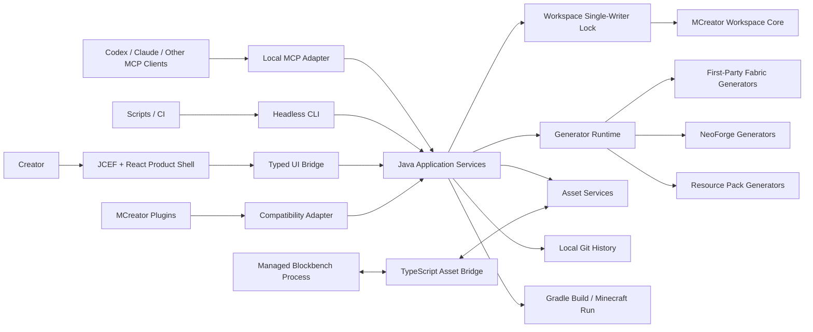

# 系统架构总览

本文描述首期 Windows 产品的模块边界。所有入口共享 Java 领域服务，不允许 UI、MCP 或 headless 各自实现一套工作区规则。

## 进程模型

桌面进程是 Java 25 JVM，承载 JCEF、领域服务、工作区写锁和本机 MCP 服务。React 产品外壳运行于 JCEF；Gradle、Minecraft 客户端和 Blockbench 作为受管子进程启动。

headless 入口是独立 Java 进程，复用相同应用服务，只暴露构建、校验、导出及脚本所需操作。桌面与 headless 不得同时写同一工作区；获取不到写锁时应返回结构化冲突，而不是继续执行。

## 所有权

| 模块 | 拥有的数据或规则 | 不允许拥有 |
| --- | --- | --- |
| Workspace Core | 工作区结构、模组元素、生成器选择 | UI 布局、MCP 协议 |
| Application Services | 命令事务、校验、权限、恢复点、并发规则 | React 组件、加载器模板 |
| Generator Runtime | 能力矩阵、模板选择、代码与资源生成 | 工作区历史、权限审批 |
| Product Shell | 导航、信息呈现、输入状态、窗口布局 | 文件写入、业务校验、领域对象 |
| MCP Adapter | MCP Schema、会话令牌、工具到命令的映射 | 独立工作区写入逻辑 |
| Headless CLI | 参数解析、机器可读输出、退出码 | 与桌面不同的业务规则 |
| Asset Services | 资产标识、引用、导入导出和版本 | Blockbench 编辑器内部状态 |
| Local History | 版本、差异、恢复点和还原 | 远程托管账户 |

## 一致性规则

- 每个工作区同一时刻只有一个活动生成器和一个写入者。
- 变更命令携带预期工作区修订号；修订号过期时拒绝写入并要求刷新。
- 一组领域变更只有完整成功或完整失败两种结果。
- AI/MCP 变更前创建恢复点；失败不得留下半个模组元素或失效引用。
- 生成源码、手写源码与用户直接修改的生成文件在状态和报告中明确区分。
- 产品专属元数据有命名空间和 Schema 版本，未知上游字段不得静默删除。

## 外部边界

- MCP 只监听 `localhost`，使用工作区会话令牌。
- Blockbench 只获得当前资产任务所需路径和操作范围。
- Java 插件是独立的完全信任边界，不受 MCP 权限档位限制。
- 正式版不依赖账户、自有云、CDN 或默认遥测。
