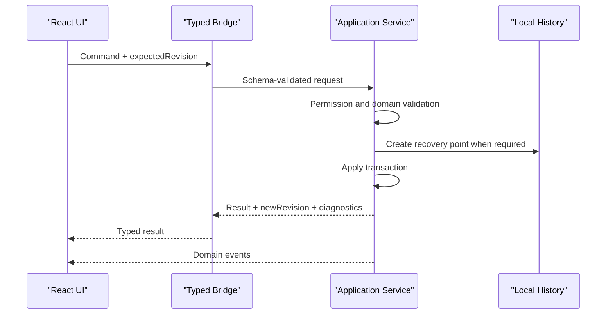

# UI 与 Java Core 合同

本文是 zcodeglm5.3 UI 工作流与 Java 核心之间的强制接口合同。

冻结合同位于 [`ui-core/schemas/v1.0`](../../ui-core/schemas/v1.0)，模拟场景位于 [`ui-core/fixtures/v1.0`](../../ui-core/fixtures/v1.0)。阶段 1-2 的 `v0.1` 目录作为兼容基线保留；Java Core 与当前产品外壳默认协商 `1.0`。

## 接口类型

**Command** 表达一次可能修改状态或启动进程的意图。命令必须经过权限检查、Schema 校验、领域校验、恢复点策略和事务提交。

**Query** 只读取投影数据，不修改工作区、不隐式生成代码，也不启动外部进程。

**Event** 通知 UI 已发生的事实。事件包含新的工作区修订号，不能被 UI 当作命令再次执行。

## 通用信封

```json
{
  "messageType": "command",
  "schemaVersion": "1.0",
  "requestId": "uuid",
  "workspaceId": "stable-workspace-id",
  "expectedRevision": 42,
  "operation": "update_mod_element",
  "payload": {}
}
```

命令结果至少包含 `messageType`、`requestId`、结果状态、`newRevision`、诊断列表和恢复点标识。查询结果包含投影所对应的 `revision`；事件包含单调递增的 `sequence`。错误使用稳定错误代码，不让前端解析 Java 异常文本。

`workspaceId`、元素标识和任务标识都是不透明稳定 ID。Schema 中的 `path` 是领域字段 JSON Pointer，不是本机文件路径。

## 命令生命周期



## 前端限制

- 不直接读写工作区文件、`.git`、Gradle 缓存或凭据。
- 不通过 JCEF JavaScript bridge 暴露任意反射、任意路径或命令执行。
- 不缓存可变 Java 对象；只保存带修订号的序列化投影。
- 不在前端复制加载器支持矩阵、迁移规则或权限判断。
- 不根据英文异常文本决定 UI 行为。
- 不把“请求已发送”显示为“保存成功”；只接受提交结果事件。
- 不根据加载器名称、Minecraft 版本或权限档位推导可用能力；使用 Core 返回的 `capabilityDecision`。
- 不把被标记为不可用的加载器专属字段从编辑状态中删除；只读显示并保留原值。

## UI 状态要求

每个核心工作流必须提供空、加载、成功、部分能力、校验失败、权限拒绝、修订冲突、外部进程退出和离线状态。长任务提供进度、日志入口、取消能力及最终结果，不用无限加载动画隐藏状态。

## 窗口合同

Java 宿主提供窗口最小化、最大化、恢复、关闭、拖动区域、边缘缩放、Snap 命中、系统菜单、DPI 和显示器变化事件。React 只声明可拖动区域与窗口按钮意图，不直接调用未类型化的本机接口。

无边框能力不可用时，宿主切换系统窗口框架并发送状态事件；前端不得假定自定义标题栏永久存在。

## 版本策略

- Schema 使用主次版本号。
- `0.x` 是阶段 1-2 的预稳定合同，变更必须同时更新 fixtures 和迁移说明。
- 新增可选字段属于次版本兼容变化。
- 删除字段、改变语义或收紧枚举属于主版本变化。
- UI 与 Java Core 启动时协商版本；不兼容时显示可诊断错误，不降级为任意 JSON。
- MCP 工具 Schema 应从同一领域合同派生或进行契约映射测试。

## JCEF 接线边界

- Java 侧 `JcefBridgeEndpoint` 只接受 `handshake`、`command` 和 `query` JSON 信封；命令事件通过独立 event sink 推送。
- TypeScript 侧 `JcefCoreBridge` 只依赖 `JcefHostTransport.invoke/onEvent/workspaceId`，不接触 Java 对象或任意文件 API。
- 阶段 3 保持 `ui-shell/src/bridge/index.ts` 绑定 `MockCoreBridge`。阶段 4 只在宿主已注入传输且握手通过后替换绑定。
- 未协商到 `1.0` 的命令/查询由 Java 端拒绝，不进行无类型 JSON 降级。
